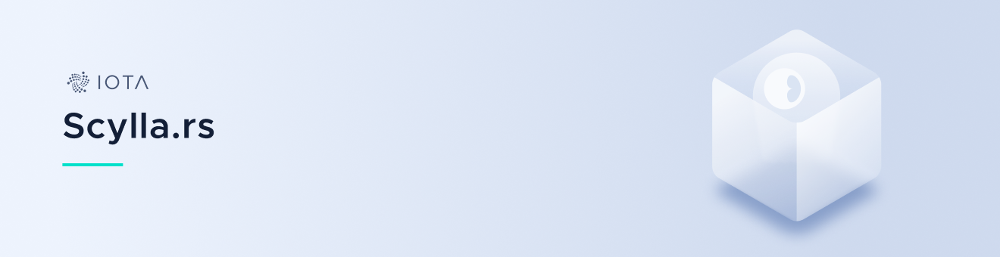

<h1 align="center">
  <br>
  <a href="#"></a>
</h1>

<h2 align="center">An async ScyllaDB driver built on an actor-model framework</h2>

<p align="center">
    <a href="https://docs.iota.org" style="text-decoration:none;">
    
</p>
<p align="center">
    <a href="https://github.com/iotaledger/scylla.rs/actions" style="text-decoration:none;"></a>
    <a href="https://github.com/iotaledger/scylla.rs/actions" style="text-decoration:none;"></a>
    <a href="https://discord.iota.org/" style="text-decoration:none;"></a>
    <a href="https://iota.stackexchange.com/" style="text-decoration:none;"></a>
    <a href="https://github.com/iotaledger/scylla.rs/blob/master/LICENSE" style="text-decoration:none;"></a>
    <a href="https://dependabot.com" style="text-decoration:none;"></a>
</p>

<p align="center">
  <a href="#about">About</a> ◈
  <a href="#prerequisites">Prerequisites</a> ◈
  <a href="#getting-started">Getting Started</a> ◈
  <a href="#supporting-the-project">Supporting the project</a> ◈
  <a href="#joining-the-discussion">Joining the discussion</a> ◈
  <a href="#future-work">Future work</a> ◈
  <a href="#LICENSE">LICENSE</a>
</p>

---

## About

Scylla<area>.rs provides fast and safe interoperability between rust applications and a distributed Scylla database. Scylla<area>.rs is built on the IOTA actor framework [backstage](https://github.com/iotaledger/backstage), but does not require dependent apps to use this framework.

Scylla<area>.rs is divided into two parts:

- **Application:** Contains traits that simplify database access as well as the actor implementation which manages the database connection. This functionality is feature gated with the `app` feature.
- **CQL:** Contains CQL frame definitions as well as utilities for compression, hashing, and building frames.

**Note:** This is alpha software, so there may be performance and stability issues. Please report any issues in our [issue tracker](https://github.com/iotaledger/scylla.rs/issues/new).

## Prerequisites
Scylla<area>.rs requires a connection to a running Scylla instance via the address and port. See [here](https://hub.docker.com/r/scylladb/scylla/) for instructions on creating a docker instance.

### Getting Started
Start by adding scylla to your `Cargo.toml` file.

```toml
scylla-rs = "0.1"
```

Next, construct the Scylla actor. This should be done by adding the `Scylla` actor to the Backstage `launcher!` macro:

```rust
launcher!(builder: AppsBuilder {[] -> Scylla<Sender>: ScyllaBuilder<Sender>}, state: Apps {});
```

Start the launcher by calling:

```rust
// Create the `Apps` struct by invoking `AppsBuilder::build`
let apps = AppsBuilder::new().build();
// Start the launcher
apps.Scylla()
    .await
    // The following enables us to immediately add a node to
    // the ring using the listen address configured for the 
    // Scylla actor.
    .future(|apps| async {
        let ws = format!("ws://{}/", "127.0.0.1:8080");
        let nodes = vec![([172, 17, 0, 2], 19042).into()];
        add_nodes(&ws, nodes, 1).await.expect("unable to add nodes");
        apps
    })
    .await
    .start(None)
    .await;
```

## Supporting the project

If you want to contribute to Scylla<area>.rs, consider posting a [bug report](https://github.com/iotaledger/scylla.rs/issues/new?template=bug_report.md), [feature request](https://github.com/iotaledger/scylla.rs/issues/new?template=enhancement.md) or a [pull request](https://github.com/iotaledger/scylla.rs/pulls).

Please read the following before contributing:

- [Contributing guidelines](.github/CONTRIBUTING.md)

## Joining the discussion

If you want to get involved in the community, need help with getting set up, have any issues related to Chronicle, or just want to discuss IOTA, Distributed Registry Technology (DRT) and IoT with other people, feel free to join our [Discord](https://discord.iota.org/).

## Future work

- Improve usability and documentation

## LICENSE

(c) 2021 - IOTA Stiftung

IOTA Scylla<area>.rs is distributed under the Apache License (Version 2.0).
